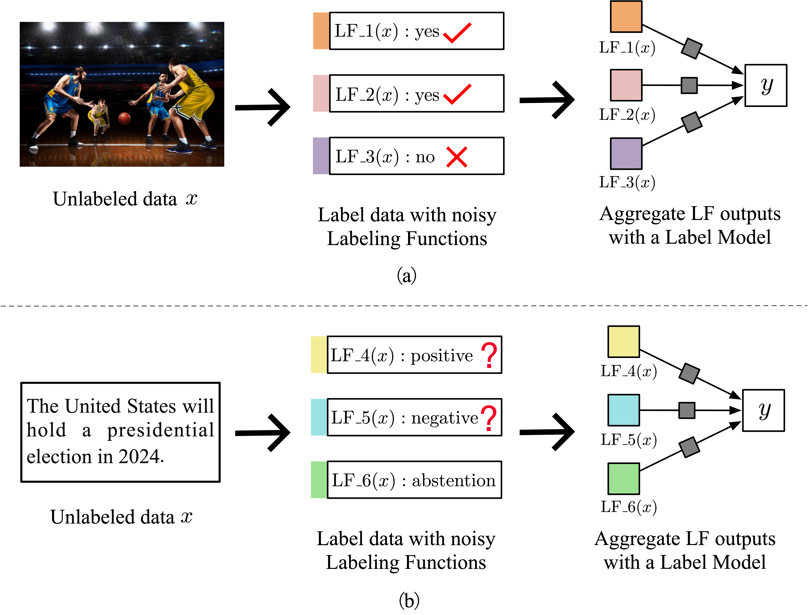
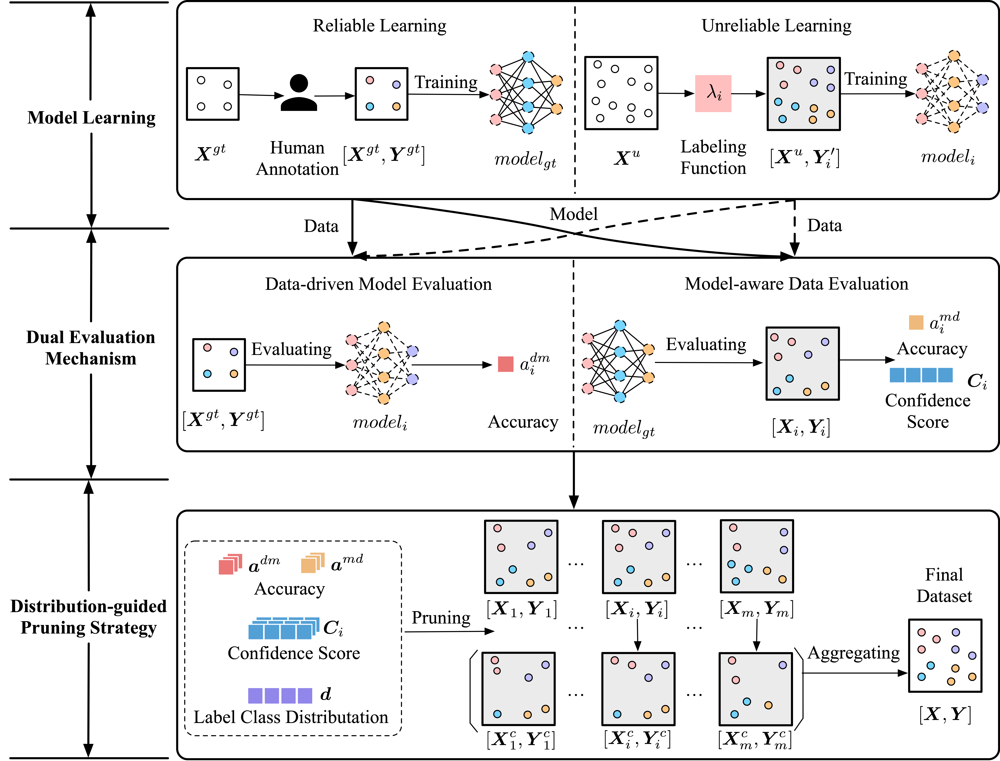
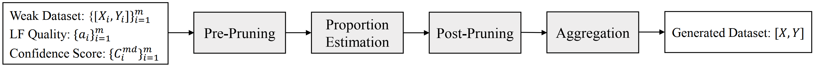

# CPWS

CPWS: Generating High-Quality Data from Confident Programmatic Weak Supervision

**Illustration of PWS**


**Framework of CPWS**


**DPS Flowchart**


**Dependencies**

Create virtual environment:

```
conda env create -f env.yml
source activate cpws
```

**Data**

Datasets are available here:

Yelp: [link](https://drive.google.com/drive/folders/1rI6wKit4oq3nneqyw4uWrvKw7_b3ut4r?usp=drive_link)

AGNews: [link](https://drive.google.com/drive/folders/1IFuRObRwPBLjTdFgjKxzbyR5Z0KxYxHo?usp=drive_link)

Tennis Rally: [link](https://drive.google.com/drive/folders/1z983x_QPvDwJqLaWxevSQ9xRHmJenrBa?usp=drive_link)

Basketball: [link](https://drive.google.com/drive/folders/1Z7Odq8RukYWYkXFEXB9pWD7Td77miLb2?usp=drive_link)

Our project is built based on Python, Pytorch and Wrench. We sincerely thank the efforts of all the researchers!

**Examples**

Train an end model on true data-label pairs in a supervised manner.

```
python supervised_learning.py
```

Train an end model on PWS-generated weak datasets.

```
python weakly_supervised_learning.py
```

Weak dataset preparing

```
python data_preparing.py
```

Pre_prune data.

```
python pre_prune.py
```

Post_prune data

```
python post_prune.py
```

Aggregate weak datasets.

```
from cpws import CPWS

cpws = CPWS()

cpws.aggregation(fp_in=['datasets/yelp/datasets_1/train_ud_wo_ab0_cs_clean_pr.json',
                    'datasets/yelp/datasets_1/train_ud_wo_ab1_cs_clean_pr.json',
                    'datasets/yelp/datasets_1/train_ud_wo_ab2_cs_clean_pr.json',
                    'datasets/yelp/datasets_1/train_ud_wo_ab3_cs_clean_pr.json',
                    'datasets/yelp/datasets_1/train_ud_wo_ab4_cs_clean_pr.json',
                    'datasets/yelp/datasets_1/train_ud_wo_ab5_cs_clean_pr.json',
                    'datasets/yelp/datasets_1/train_ud_wo_ab6_cs_clean_pr.json',
                    'datasets/yelp/datasets_1/train_ud_wo_ab7_cs_clean_pr.json'],
                    fp_out='datasets/yelp/datasets_1/train_ud_wo_ab_cs_clean_pr_agg.json')
```

Count class rate.

```
from cpws import CPWS

cpws = CPWS()

print(cpws.count_class_rate(fp='datasets/yelp/datasets_1/train_rd.json', fd_name='yelp'))
```

**Reference**

- [WRENCH: A Comprehensive Benchmark for Weak Supervision](https://arxiv.org/abs/2109.11377) [[code]](https://github.com/JieyuZ2/wrench)
